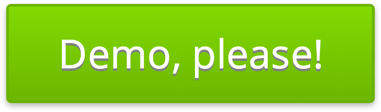

# [Suave UI 0.2.0](http://uoziod.github.io/suave-ui)
### UI Framework for AngularJS

Suave UI is designed for web-applications based on [AngularJS](http://angularjs.org). It consists of CSS definitions, directives and services that helps build UI quick and efficiently.

## Components

All these components are included into bundle-files. So you don't need to include them separately to use all them force.

- [Font Awesome 4.2.0](http://fontawesome.io/) provides icons.
- [Animate.css 3.1.1](http://daneden.github.io/animate.css/) provides CSS-animations. 

## How to use?

To begin use Suave UI you had to add CSS & JS bundle-files and include `suave-ui` angular-module into your web-app initialization via Dependency Injection or `angular.bootstrap`.

    <link rel="stylesheet" href="suave-ui/build/styles.min.css" />
    
    

    

Then you can use Suave directives, services and styles right in your code. [Demo & Examples is available here](http://uoziod.github.io/suave-ui).

## License

- **Suave UI** is inspired by [Actiguide](https://github.com/tansky/actiguide) licensed under the MIT
- [Font Awesome](http://fontawesome.io/) font is licensed under the SIL OFL 1.1
- [Animate.css](http://daneden.github.io/animate.css/) is licensed under MIT
