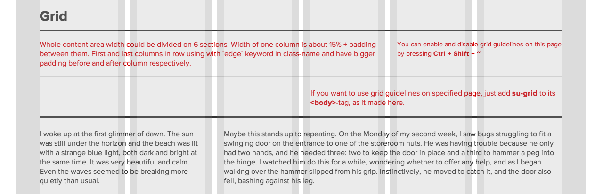

# [Suave UI 0.1.1](http://uoziod.github.io/suave-ui)
### UI Framework for AngularJS

Suave UI is inspired by [Actiguide](https://github.com/tansky/actiguide). This UI framework is designed for 
web-applications based on [AngularJS](http://angularjs.org). It consists of different useful stuff like content grid,
buttons, popups, dropdowns and notifications.

## Components

All components are included into bundle-files.

- [Font Awesome](http://fontawesome.io/) using for icons.
- [Animate.css](http://daneden.github.io/animate.css/) using for CSS-animations. 

## Usage

To start using Suave UI you need to add CSS & JS bundle-files and include **suave-ui** angular-module into your web-app
initialization via DI or `angular.bootstrap`.

    <link rel="stylesheet" href="suave-ui/build/styles.min.css" />
    
    

    

Then you can use Suave UI public directives and services right in your code. [Demo & Examples is available here](http://uoziod.github.io/suave-ui).

## Suave UI directives

- [suDropdown](#suDropdown)
- [suGrid](#suGrid)
- [suIcon](#suIcon)
- [suIconCircle](#suIconCircle)
- [suPopup](#suPopup)
- [suTarget](#suTarget)

### <a name="suDropdown"/>suDropdown

Dropdown is layered element. `suDropdown` creates dropdown elements. Using as tag with required attribute `anchor`,
that is for setting specified dropdown ID for [suTarget](#suTarget).

    <su-dropdown anchor="dropdown-id">
        
This is dropdown

    </su-dropdown>
    
    <a su-target="dropdown-id">Open dropdown</a>

See also: [suTarget](#suTarget)

### <a name="suGrid"/>suGrid

Whole content area width could be divided on 6 sections. Width of one column is about 15% + padding between them. First and last columns in row using with <strong>edge</strong> keyword in class-name and have bigger padding before and after column respectively.

It's possible to see following rules visually thankfully `suGrid` directive that enables *grid guidelines*. It should be used as attribute in any tag (but `<body>` is recommended). To turn on and off grid guidelines use **Ctrl + Shift + ~** combination.

### <a name="suIcon"/>suIcon

This directive using as attribute for button tags to add Font Awesome icon before the text.

    <input su-icon="fa-leaf" type="button" value="Just button" />
    <input su-icon="fa-check" type="submit" value="Complete" class="positive" />

See also: [suIconCircle](#suIconCircle)

### <a name="suIconCircle"/>suIconCircle

Another one directive to create buttons with icon from Font Awesome.

    <input type="button" su-icon-circle="fa-print" value="Print file..." />

See also: [suIcon](#suIcon)

### <a name="suPopup"/>suPopup

Popup is layered element. `suPopup` creates configurable popup. Using as tag with required attribute `anchor`,
that is for setting specified popup ID for [suTarget](#suTarget). Optional tag `config` is JSON-object that using for
popup configuration.

Possible `config` properties:

- **title**. String. For popup title setting 
- **noPadding**. Boolean. If true popup container will have no padding. Useful when inserting only 1 image inside popup.

Usage example

    <su-popup anchor="p1" config='{
        "title": "Popup title"
    }'>
        This is popup
    </su-popup>

### <a name="suTarget"/>suTarget

This directive should be used to open layered element. Using as attribute with value that equal calling layered element identifier set with `anchor`.

    <su-dropdown anchor="dropdown-id">
        
This is dropdown

    </su-dropdown>
    
    <su-popup anchor="popup-id">
        
This is popup

    </su-popup>
    
    <a su-target="dropdown-id">Open dropdown</a>
    <a su-target="popup-id">Open popup</a>

See also: [suDropdown](#suDropdown), [suPopup](#suPopup)

## Suave UI services

- [suSnackbar](#suSnackbar)

### <a name="suSnackbar"/>suSnackbar

## License

- **Suave UI** is licensed under the MIT License
- [Font Awesome](http://fontawesome.io/) font is licensed under the SIL OFL 1.1
- [Animate.css](http://daneden.github.io/animate.css/) is licensed under MIT License
