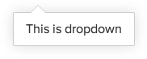
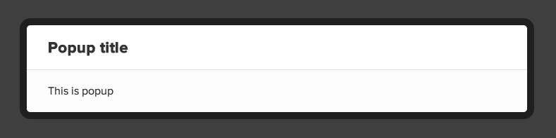

## Suave UI directives

- [suDropdown](#suDropdown)
- [suGrid](#suGrid)
- [suIcon](#suIcon)
- [suPopup](#suPopup)
- [suTarget](#suTarget)

### <a name="suDropdown"/>suDropdown

Dropdown is layered element. `suDropdown` creates dropdown elements. Using as tag with required attribute `anchor`,
that is for setting specified dropdown ID for [suTarget](#suTarget).

    <su-dropdown anchor="dropdown-id">
        
This is dropdown

    </su-dropdown>
    
    <a su-target="dropdown-id">Open dropdown</a>

See also: [suTarget](#suTarget)

### <a name="suGrid"/>suGrid

Whole content area width could be divided on 6 sections. Width of one column is about 15% + padding between them. First and last columns in row using with <strong>edge</strong> keyword in class-name and have bigger padding before and after column respectively.

It's possible to see following rules visually thankfully `suGrid` directive that enables *grid guidelines*. It should be used as attribute in any tag (but `<body>` is recommended). To turn on and off grid guidelines use **Ctrl + Shift + ~** combination.

### <a name="suIcon"/>suIcon

This directive using as attribute for button tags to add Font Awesome icon before the text.

    <input type="button" su-icon="fa-leaf" value="Just button" />
    <input type="submit" su-icon="fa-check" value="Complete" class="positive" />

You can use alternative button style. Just add `button-type="circle"` into element declaration: 

    <input type="button" su-icon="fa-print" button-type="circle" value="Print file..." />

### <a name="suPopup"/>suPopup

Popup is layered element. `suPopup` creates configurable popup. Using as tag with required attribute `anchor`,
that is for setting specified popup ID for [suTarget](#suTarget). Optional tag `config` is JSON-object that using for
popup configuration.

Possible `config` properties:

- **title**. String. For popup title setting 
- **noPadding**. Boolean. If true popup container will have no padding. Useful when inserting only 1 image inside popup.

Usage example:

    <su-popup anchor="p1" config='{
        "title": "Popup title"
    }'>
        This is popup
    </su-popup>

### <a name="suTarget"/>suTarget

This directive should be used to open layered element. Using as attribute with value that equal calling layered element
identifier set with `anchor`.

    <su-dropdown anchor="dropdown-id">
        
This is dropdown

    </su-dropdown>
    
    <su-popup anchor="popup-id">
        
This is popup

    </su-popup>
    
    <a su-target="dropdown-id">Open dropdown</a>
    <a su-target="popup-id">Open popup</a>

See also: [suDropdown](#suDropdown), [suPopup](#suPopup)

[&laquo; Back to Users Manual](index.md)
