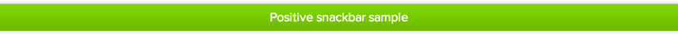

## Suave UI services

- [suSnackbar](#suSnackbar)

### <a name="suSnackbar"/>suSnackbar

**Snackbar** is a colorful stripe with text that hangs on top part of the page by default. Snackbar hangs on screen for
5 seconds, but it's default value that could be changed too.

#### push

To add snackbar on page public method `push` is using. First parameter of this method is displaying text. Second
optional parameter is configuration object.

Possible values:

- color: [Control elements color](styles.md#style-controls) value
- timeout: time in milliseconds after which the item will disappear

Usage example:

    yourApp.controller('YourController', function($scope, suSnackbar) {
        $scope.$on('someEvent', function() {
            suSnackbar.push('Positive snackbar sample', {
                color: positive,
                timeout: 10000
            })
        });
    });

[&laquo; Back to Users Manual](index.md)
