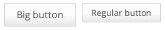
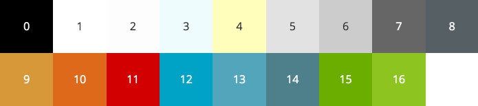
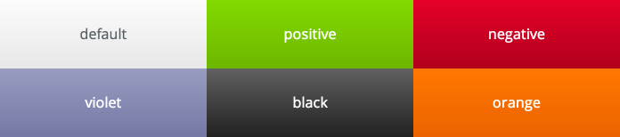

## Suave UI styles

- [Basic definitions](#style-basic)
- [Basic colors](#style-basic-colors)
- [Interaction elements colors](#style-interaction-colors)

### <a name="style-basic"/>Basic definitions

#### Buttons

Any button element (`<input type="button" />` or `<input type="submit" />`) can have class `big`, that makes button
bigger.

    <input type="button" class="big" value="Big button" />
    <input type="button" value="Regular button" />

Buttons are interaction elements, so they can have [Interaction elements colors](#style-interaction-colors).

### <a name="style-basic-colors"/>Basic colors

This is basic colors table:

The given numbers correspond to the colors. You can use this colors for text as well as for backgrounds. For set color
for text use its number with c prefix in class name, for background use color number with bc prefix.

    
white text on black background

### <a name="style-interaction-colors"/>Interaction elements colors

Interaction elements is buttons and snackbars. They can take following colors:

[&laquo; Back to Users Manual](index.md)
