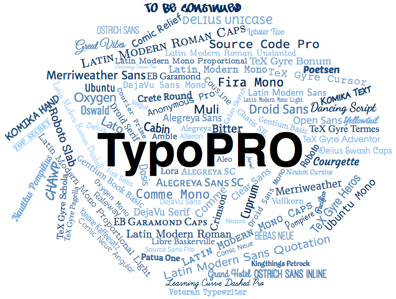

TypoPRO 2.2.3
=============

http://typopro.org/

*Fonts for Professional Typography &mdash; The Non-Cloud Way!*

**TypoPRO** is a carefully hand-selected collection of freely usable
professional fonts for use in Desktop Publishing, on Websites and
especially inside Web-based Desktop or Mobile Applications. Currently,
**TypoPRO** consists of 619 individual fonts of 87 font families. The
fonts in total span a very wide range of font types, font styles, font
weights and font variants. This way, **TypoPRO** provides a magnitude of
typographic possibilities with just a minimum number of font families.

Features
--------

- **Preselection** & **Assembling**:
  The fonts were carefully hand-selected, manually downloaded and
  consistently assembled into the **TypoPRO** collection. For many fonts
  the real upstream vendor origin of their latest versions had to be
  determined first, too.

- **Glyph Design**:
  All fonts are professionally crafted and have their glyphs (individual
  characters) beautifully designed and this way provide a really
  wonderful optical appearance. Most of the fonts are actually from
  professional font foundries.

- **Font Families**:
  Most of the fonts are based on reasonably large font families of
  individual fonts. This is important, because for professional
  typography results you usually always need multiple weights of at
  least the headline and text fonts.

- **Kerning**:
  Most of the fonts carry reasonable kerning information, provided by the
  font foundry: instructions for spacing adjustments between particular
  pairs of glyphs. This is important, because for professional
  typography, kerning is essential.

- **Hinting**:
  All fonts carry reasonable hinting information, provided by the
  conversion process (and its `ttfautohint` utility) of **TypoPRO**:
  display instructions for rasterization adjustments at various
  rendering sizes. This is important, because for rendering fonts on the
  Web at very small sizes, hinting is essential.

- **Liberal Licensing**:
  All fonts are under very liberal Open Source licenses and can be
  freely and unrestrictively used even in Closed Source and Commercial
  contexts.

- **Web Conversion**:
  All fonts are consistently converted from their original TTF/OTF
  format into various font formats for use on the Web: Embedded OpenType
  (EOT), Web Open Font Format (WOFF) and TrueType Font (TTF). These
  different formats for each font are required for maximum portability
  across browsers and operating systems. Suitable corresponding CSS
  `@font-face` declaration files were generated, too.

- **Unicode Character Reduction**
  Some fonts contain a really large number of glyphs, covering a wide
  range of the Unicode character set. This is great in general, but
  dramatically increases the font size, which is a major drawback on the
  web. For this reason, although it reduces the fonts to be used for
  the main Latin based languages (English, German, etc), we reduce the
  fonts in web formats to the smaller Unicode range 0000-00FF (Basic
  Latin, Latin-1 Supplement). The DTP formats of all fonts we reduce
  to the larger (but still reduced for some very large fonts) Unicode
  range set 0000-036F,1DC0-1EFF,2000-20FF,2150-218F,2C60-2C7F,A720-A7FF
  (Basic Latin, Latin-1 Supplement, Latin Extended-A, Latin Extended-B,
  IPA Extensions, Spacing Modifier Letters, Combining Diacriticals
  Marks, Combining Diacritical Marks Supplement, Latin Extended
  Additional, General Punctuation. Superscripts and Subscripts, Currency
  Symbols, Combining Diacritical Marks for Symbols, Number Forms, Latin
  Extended-C, Latin Extended-D)

- **Font Renaming**:
  To circumvent license restrictions related to font format conversions
  and to avoid confusion with the original font formats, all Web font
  format variants were renamed to consistently carry the `TypoPRO `
  prefix.

- **Font Parameters**:
  All font families consistently use a common font family name (CSS
  `font-family` attribute) and all fonts within the same font family
  are consistently distinguished via CSS parameters `font-weight`,
  `font-style`, `font-stretch` and `font-variant`.

- **Specimen**:
  For the Web font variants, a specimen in HTML format was generated to
  conveniently preview the font. See http://typopro.org/specimen/ for
  the current overview of all specimens in **TypoPRO**.

Font Overview
-------------



#### General Purpose Fonts

The fonts in this group are general purpose ones, i.e., they can be used
equally well for headlines, body text, footnotes, etc. They especially
are part of whole font families and cover a wide range of Unicode
characters.

Name                      |Fonts|Serif|Slab|Sans|Mono|Hand|Regular|Italic|Cond|Thin|Medium|Normal|Bold|Black
--------------------------|----:|:---:|:--:|:--:|:--:|:--:|:-----:|:----:|:--:|:--:|:----:|:----:|:--:|:---:
Aileron                   | 16  |     |    | X  |    |    |  X    |  X   |    | X  |  X   |  X   | X  | X
Alegreya                  | 40  |  X  |    | X  |    |    |  X    |  X   |    | X  |      |  X   | X  |
Aleo                      |  6  |     | X  |    |    |    |  X    |  X   |    | X  |      |  X   | X  |
Amble                     |  8  |     |    | X  |    |    |  X    |  X   | X  | X  |      |  X   | X  |
Anonymous&nbsp;Pro        |  4  |     |    |    | X  |    |  X    |  X   |    |    |      |  X   | X  |
Bitter                    |  4  |     | X  |    |    |    |  X    |  X   |    |    |      |  X   | X  |
Cabin                     | 14  |     |    | X  |    | X  |  X    |  X   | X  |    |  X   |  X   | X  |
Charis&nbsp;SIL           |  4  |  X  |    |    |    |    |  X    |  X   |    |    |      |  X   | X  |
Clear&nbsp;Sans           |  8  |     |    | X  |    |    |  X    |  X   |    | X  |  X   |  X   | X  |
Comme                     | 10  |     |    | X  | X  |    |  X    |  X   |    | X  |  X   |  X   | X  | X
Courier&nbsp;Prime        |  4  |     |    |    | X  |    |  X    |  X   |    |    |      |  X   | X  |
Cousine                   |  4  |     |    |    | X  |    |  X    |  X   |    |    |      |  X   | X  |
Crete&nbsp;Round          |  2  |     | X  |    |    |    |  X    |  X   |    |    |      |  X   |    |
Crimson                   |  6  |  X  |    |    |    |    |  X    |  X   |    |    |      |  X   | X  |
Cuprum                    |  4  |     |    | X  |    |    |  X    |  X   |    |    |      |  X   | X  |
DejaVu                    | 21  |  X  |    | X  | X  |    |  X    |  X   | X  | X  |      |  X   | X  |
Dosis                     |  7  |     |    | X  |    |    |  X    |  X   | X  | X  |  X   |  X   | X  | X
Droid                     |  7  |  X  |    | X  | X  |    |  X    |  X   |    |    |      |  X   | X  |
EB&nbsp;Garamond          |  4  |  X  |    |    |    |    |  X    |  X   |    |    |      |  X   | X  |
Ek&nbsp;Mukta             |  7  |     |    | X  |    |    |  X    |      |    | X  |  X   |  X   | X  | X
Fantasque&nbsp;Sans&nbsp;Mono|4 |  X  |    |    | X  |    |  X    |  X   |    |    |      |  X   | X  |
Fira&nbsp;Mono            |  2  |     |    |    | X  |    |  X    |      |    |    |      |  X   | X  |
Fira&nbsp;Sans            | 32  |     |    | X  |    |    |  X    |  X   |    | X  |  X   |  X   | X  | X
Gentium                   |  8  |  X  |    |    |    |    |  X    |  X   |    |    |      |  X   | X  |
Latin&nbsp;Modern         | 50  |  X  |    | X  | X  |    |  X    |  X   | X  | X  |  X   |  X   | X  | X
Lato                      | 10  |     |    | X  |    |    |  X    |  X   |    | X  |  X   |  X   | X  | X
Lekton                    |  3  |     |    | X  | X  |    |  X    |  X   |    |    |      |  X   | X  |
Liberation                | 12  |  X  |    | X  | X  |    |  X    |  X   |    |    |      |  X   | X  |
Libre&nbsp;Baskerville    |  3  |  X  |    |    |    |    |  X    |  X   |    |    |      |  X   | X  |
Lora                      |  4  |  X  |    |    |    |    |  X    |  X   |    |    |      |  X   | X  |
Merriweather              |  8  |  X  |    |    |    |    |  X    |  X   |    | X  |  X   |  X   | X  | X
Merriweather&nbsp;Sans    |  8  |     |    | X  |    |    |  X    |  X   |    | X  |  X   |  X   | X  | X
Muli                      | 10  |     |    | X  |    |    |  X    |  X   |    | X  |  X   |  X   | X  | X
Neuton                    |  7  |  X  |    |    |    |    |  X    |  X   |    | X  |  X   |  X   | X  | X
Noto&nbsp;Sans            |  4  |     |    | X  |    |    |  X    |  X   |    |    |      |  X   | X  |
Noto&nbsp;Serif           |  4  |  X  |    |    |    |    |  X    |  X   |    |    |      |  X   | X  |
Open&nbsp;Sans            | 13  |     |    | X  |    |    |  X    |  X   | X  |    |  X   |  X   | X  | X
Oswald                    | 14  |     |    | X  |    |    |  X    |  X   |    | X  |  X   |  X   | X  | X
Overlock                  |  4  |     |    | X  |    |    |  X    |  X   |    |    |      |  X   | X  |
Oxygen                    |  5  |     |    | X  | X  |    |  X    |  X   |    |    |      |  X   | X  |
Poly                      |  2  |  X  |    |    |    |    |  X    |  X   |    |    |      |  X   |    |
Raleway                   | 18  |  X  |    |    |    |    |  X    |  X   | X  | X  |  X   |  X   | X  | X
Roboto                    | 12  |     |    | X  |    |    |  X    |  X   | X  | X  |  X   |  X   | X  |
Rosario                   |  4  |     |    | X  |    |    |  X    |  X   |    |    |      |  X   | X  |
Signika                   |  4  |     |    | X  |    |    |  X    |  X   |    |    |      |  X   | X  |
Sinkin&nbsp;Sans          | 18  |     |    | X  |    |    |  X    |  X   |    | X  |  X   |  X   | X  | X
Source&nbsp;Code&nbsp;Pro |  7  |     |    |    | X  |    |  X    |      |    | X  |  X   |  X   | X  | X
Source&nbsp;Sans&nbsp;Pro | 12  |     |    | X  |    |    |  X    |  X   |    | X  |  X   |  X   | X  | X
Source&nbsp;Serif&nbsp;Pro|  3  |  X  |    |    |    |    |  X    |      |    |    |  X   |  X   | X  |
TeX&nbsp;Gyre             | 33  |  X  |    | X  | X  | X  |  X    |  X   | X  | X  |  X   |  X   | X  |
Ubuntu                    | 13  |     |    | X  | X  |    |  X    |  X   | X  | X  |  X   |  X   | X  |
Vegur                     |  3  |     |    | X  |    |    |  X    |      |    |    |  X   |  X   | X  |
Vollkorn                  |  4  |  X  |    |    |    |    |  X    |  X   |    |    |      |  X   | X  |
Webly&nbsp;Sleek          |  6  |     |    | X  |    |    |  X    |  X   |    | X  |      |  X   | X  |
Yanone&nbsp;Kaffeesatz    |  4  |     |    | X  |    |    |  X    |      |    | X  |  X   |  X   | X  |

#### Special Purpose Fonts

The fonts in this group are special purpose ones, i.e., they are usually
used only for particular headlines, subtitles, tags, etc. They are
usually just stand-alone fonts and cover just a very limited set of
Unicode characters.

Name                      |Fonts|Serif|Sans|Mono|Hand|Regular|Italic|Cond|Thin|Medium|Normal|Bold|Black
--------------------------|----:|:---:|:--:|:--:|:--:|:-----:|:----:|:--:|:--:|:----:|:----:|:--:|:---:
Bebas&nbsp;Neue           |  1  |     | X  |    |    |  X    |      |    |    |      |      |    | X
Bellota                   |  6  |     |    |    |    |  X    |  X   |    |    |  X   |      | X  |
Chawp                     |  1  |     |    |    | X  |       |      |    |    |      |      | X  |
Comic&nbsp;Neue           | 12  |     | X  |    | X  |  X    |  X   |    | X  |      |  X   | X  |
Comic&nbsp;Relief         |  2  |     |    |    | X  |       |      |    |    |      |  X   | X  |
Courgette                 |  1  |     |    |    | X  |       |  X   |    |    |      |  X   |    |
Damion                    |  1  |     |    |    | X  |       |      |    |    |      |  X   |    |
DancingScript             |  2  |     |    |    | X  |       |      |    |    |      |  X   | X  |
Delius                    |  4  |     |    |    | X  |  X    |      |    |    |      |  X   | X  |
Grand&nbsp;Hotel          |  1  |     |    |    | X  |  X    |      |    |    |      |  X   |    |
Graziano                  |  1  |     |    |    | X  |       |  X   |    |    |      |  X   |    |
Great&nbsp;Vibes          |  1  |     |    |    | X  |       |  X   |    |    |      |  X   |    |
HH&nbsp;Samuel            |  1  |     | X  |    |    |  X    |      |    |    |      |      |    | X
Journal                   |  1  |     |    |    | X  |       |  X   |    |    |      |  X   |    |
Junction                  |  3  |     | X  |    |    |  X    |      |    |    |  X   |  X   | X  |
Kalam                     |  3  |     |    |    | X  |  X    |      |    |    |  X   |  X   | X  |
Kaushan Script            |  1  |     |    |    | X  |  X    |      |    |    |      |  X   |    |
Kingthings&nbsp;Petrock   |  2  |     |    |    | X  |  X    |      |    | X  |      |  X   |    |
Komika&nbsp;Hand          |  4  |     | X  |    | X  |  X    |  X   |    |    |      |  X   | X  |
Komika&nbsp;Text          | 10  |     | X  |    |    |  X    |  X   |    | X  |      |  X   | X  |
Learning&nbsp;Curve       |  2  |     |    |    | X  |       |  X   |    | X  |      |  X   |    |
Lobster&nbsp;Two          |  4  |     |    |    | X  |  X    |  X   |    |    |      |  X   | X  |
Nautilus&nbsp;Pompilius   |  1  |     |    |    | X  |  X    |      |    |    |      |  X   |    |
Ostrich&nbsp;Sans         |  9  |     | X  |    |    |  X    |      |    | X  |  X   |  X   | X  | X
Patua&nbsp;One            |  1  |     |    |    | X  |       |  X   |    |    |      |  X   |    |
Poetsen                   |  1  |     |    |    | X  |  X    |      |    |    |      |      |    | X
Pompiere                  |  1  |     |    |    | X  |  X    |      |    |    |      |  X   |    |
Sansita&nbsp;One          |  1  |     |    |    | X  |       |  X   |    |    |      |      | X  |
Satisfy                   |  1  |     |    |    | X  |       |      |    |    |      |  X   |    |
To&nbsp;Be&nbsp;Continued |  1  |     |    |    | X  |  X    |      |    |    |      |      |    | X
Top&nbsp;Secret           |  1  |     | X  |    |    |  X    |      |    |    |      |      |    | X
Veteran&nbsp;Typewriter   |  1  |     |    | X  |    |       |      |    |    |      |  X   |    |
Yellowtail                |  1  |     |    |    | X  |       |  X   |    |    |      |  X   |    |

Browser Support
---------------

All major browsers are fully supported by TypoPRO due to the fact
that each font is provided in multiple formats. The actual minimum
browser version which supports a particular format follows (for latest
information see [1](http://caniuse.com/eot) [2](http://caniuse.com/ttf)
[3](http://caniuse.com/woff)):

Browser                     | EOT  | TTF  | WOFF
----------------------------|-----:|-----:|-----:
Internet Explorer (Desktop) | 6.0  |  9.0 |  9.0
Internet Explorer (Mobile)  | --   |  --  | 10.0
Mozilla Firefox (Desktop)   | --   |  3.5 |  3.6
Mozilla Firefox (Mobile)    | --   | 26.0 | 26.0
Google Chrome (Desktop)     | --   |  4.0 |  5.0
Google Chrome (Mobile 2)    | --   | 33.0 | 33.0
Google Chrome (Mobile 1)    | --   |  2.2 |  4.4
Apple Safari (Desktop)      | --   |  3.1 |  5.1
Apple Safari (Mobile)       | --   |  4.2 |  5.0
Opera (Desktop)             | --   | 10.0 | 11.1
Opera (Mobile)              | --   | 10.0 | 11.0

This means that for the latest versions of all major
browsers the optimized WOFF format would be both sufficient and
preferred. But for backward compatibility to older browser versions, the
EOT and TTF formats are still provided, too.

Notice: The fonts are intentionally not (or more precise: no longer since
TypoPRO 2.0) provided in the additional browser-supported SVG font
format. The reason simply is that since a longer time this gives not
really any additional effective cross-browser compatibility and just
unnecessarily increases the (already rather large) TypoPRO distribution
size.

Alternatives
------------

Nowadays, most of the fonts can also be individually
downloaded for free from _online_ font libraries like
[Font Squirrel](http://www.fontsquirrel.com/),
[DaFont](http://www.dafont.com/),
[Fonts2U](http://www.fonts2u.com) or
[fontsc](http://www.fontsc.com) or even _on-the-fly_ used from font
Cloud services like [Google Fonts](http://www.google.com/fonts),
[Open Font Library](http://openfontlibrary.org/),
[Adobe Edge Web Fonts](https://edgewebfonts.adobe.com/),
[Adobe Typekit](https://typekit.com/),
[FontDeck](http://fontdeck.com/) or
[Brick](http://brick.im/). But the purpose of **TypoPRO** is just
different: it provides an _offline_ solution and it intentionally
is a very opinionated pre-selection of reasonable (meaning
high-quality) fonts.

Download
--------

You can conveniently download snapshots or particular versions of **TypoPRO** in various ways:

- Bower: install as client component via the Bower component manager:<br/>
  `$ bower install typopro`<br/>
  `$ bower install typopro#2.2.3`

- NPM: install as server component via the Node Package Manager:<br/>
  `$ npm install typopro`<br/>
  `$ npm install typopro@2.2.3`

- cURL: download directly from the Github repository:<br/>
  `$ curl -O https://github.com/rse/typopro/archive/master.zip`<br/>
  `$ curl -O https://github.com/rse/typopro/archive/2.2.3.zip`

Alternatively, you can use [Grunt](http://gruntjs.com/) and
my companion [Grunt-TypoPRO](https://www.npmjs.org/package/grunt-typopro)
task for conveniently installing **TypoPRO** font families.

Desktop Usage
-------------

The DTP variants of all fonts you can find under `dtp/`. Just
install those files into your system:

- For Windows: For single and bulk installs, right-click one or more `*.ttf` files and choose "Install"
  from the context menu.

- For Mac OS X: For single installs, open the `*.ttf` file with the Font Book app
  and choose "Install Font". For bulk installs drag & drop the
  fonts into the `Fonts` folder of the `Library` folder in the
  Finder app.

- For GNU/Linux:
  For single installs, open the `*.ttf` file with the Font Viewer app
  and choose "Install". For bulk installs copy the
  `*.ttf` files into `/usr/local/share/fonts/truetype` folder of your system
  and run `sudo fc-cache`.

Web Usage
---------

It is important that the font files are delivered to the browser with
the correct MIME content-types. You can use the following Apache
`.htaccess` configuration snippet to achieve this:

    #   provide reasonable MIME content-types
    <IfModule mime_module>
        AddType application/vnd.ms-fontobject eot
        AddType application/font-woff         woff
        AddType application/x-font-ttf        ttf
    </IfModule>

    #   compress all fonts (except already compressed WOFF)
    <IfModule deflate_module>
        AddOutputFilter DEFLATE eot ttf
    </IfModule>

In order to use an individual font you have to use
two steps:

1. Include the `@font-face` based CSS font declaration:

    ```html
    <html>
        <head>
            [...]
            <link href="web/TypoPRO-Lora/TypoPRO-Lora-Regular.css" rel="stylesheet" type="text/css"/>
            [...]
        </head>
        [...]
    </html>
    ```

2. Use CSS to apply it to some of your HTML elements:

    ```html
    <html>
        <head>
            [...]
            <style type="text/css">
                .sample {
                    font-family: "TypoPRO Lora";
                    font-weight: bold;
                    font-size: 14pt;
                }
            </style>
            [...]
        </head>
        <body>
        [...]
            <div class="sample">The Quick Brown Fox Jumps Over The Lazy Dog</div>
        [...]
        </body>
    </html>
    ```

Recommendation
--------------

For general purpose typography, I can recommend you all of the above 55
General Purpose fonts, of course. But my personal preference most of
the times is towards the fonts in the following table. There are many
reasons for this, but mainly all those fonts, each in their class, in my
humble opinion, provide the best balance of legibility (because of very
distinct glyph outlines), beauty (because of very harmonic glyph curves)
and versatility (because of their different available stroke widths and
optional italic variants).

Sans&nbsp;Serif:|Slab&nbsp;Serif:|Serif:       |Monospaced:         |Script:            |Display:
----------------|----------------|-------------|--------------------|-------------------|---------
Fira Sans       |Roboto Slab     |Droid Serif  |DejaVu Sans Mono    |Journal            |Overlock
Roboto          |Aleo            |Merriweather |Anonymous Pro       |Delius             |Yanone Kaffesatz
Source Sans Pro |Bitter          |Lora         |Latin Modern Mono   |Kalam              |Poetsen One
Open Sans       |                |             |                    |Nautilius Pompilius|

Manifest
--------

The **TypoPRO** distribution consists primarily of three content areas:

- `src/`: all font source files (formats: TTF, OTF)
- `dtp/`: all font target files for DTP (Desktop Publishing) usage (formats: TTF)
- `web/`: all font target files for Web (World Wide Web) usage (formats: TTF, EOT, WOFF)

All source files are as provided by the upstream font vendor, just with
filenames aligned to the usual **TypoPRO** conventions. For the DTP and Web
targets, the fonts are subsetted (see "Unicode Character Reduction"
above), renamed and format converted.

Rebuilding
----------

In order to rebuild the `web/` and `dtp/` files from the `src/` files,
you have to use the `etc/convert.sh` script. It needs Ralf S. Engelschall's **fontface**
utility, as provided by the [OpenPKG](http://www.openpkg.org/) package `fontface`,
and a magnitude of backend programs for font conversion: [FontForge](http://fontforge.org/),
[font-optimizer](http://bitbucket.org/philip/font-optimizer/) and [ttf2eot](http://ttf2eot.googlecode.com/).
On installing the OpenPKG `fontface` package, the dependencies are installed automatically.

Licensing
---------

All included font families are distributed under very liberal Open
Source licenses, either MIT License, Apache License, Open Font License
or Public Domain. For particular license details on each individual
font family, please see the files `src/*/license.txt` and the meta
information in the files `src/*/blurb.txt`.

Author
------

Ralf S. Engelschall<br/>
[http://engelschall.com](http://engelschall.com/)<br/>
[rse@engelschall.com](mailto:rse@engelschall.com)

